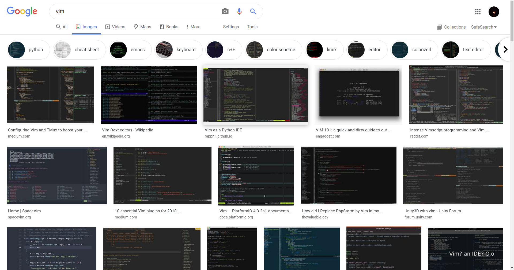

---
presentation:
  width: 1920
  height: 1300
  theme: league.css
  # progress: false
  # center: false
  controls: false
  enableSpeakerNotes: true
---

<!-- slide data-notes="大家记得改改备注.
更多分享我自己的使用经验, 而不是在基础使用上费口舌. (当然也会提一些).
一些信息在备注, 按s查看"
-->

# 我的vim经验分享

<!-- slide  -->

## 目录

---
1. [认识vim](#认识vim)
2. [都2020了怎么还在用vim 😏](#都2020了怎么还在用vim-)
3. [vim操作入门 😎](#vim操作入门-)
4. [vim配置入门 👴](#vim配置入门-)
5. [获得帮助](#获得帮助)

<!-- .element: class="fragment fade-in-then-semi-out" -->

<!-- slide data-transition="zoom" data-background-image="vim/vim_drill_small.JPG"
data-notes="vim是什么? 是电钻驰名品牌吗?
这张图来自vim官网
顺带一提因为vim作者曾去过乌干达, vim一直很热衷于帮助贫穷乌干达儿童 (但我在vim官网看到的的vim作者在乌干达的活动照他去的地方并没那么差😏"
-->

## 认识vim

<!-- slide -->

### showoff

<!-- slide -->

### 历史

推荐阅读: [Vim 和 Neovim 的前世今生](https://jdhao.github.io/2020/01/12/vim_nvim_history_development/)

<!-- slide -->

### 常见困惑与误解 🤤

<!-- slide data-center=false data-height=2000
data-notes="前几年vim或许有些方面跟不上时代, 但随着vim8推出vim变得较为潮流. 从另一方面它从未过时
任何工具都有其局限性, vim只能呈现纯文本, 无法显示网页, 图片等需要渲染的东西. markdown-preview.nvim是以一个位置同步的浏览器页面来实现markdown文件预览的. 但也有其他方式, 比如一个终端浏览器. 只要终端支持显示图片, 那么就基本完美.
下方有一张Google搜vim图片"
-->

- 代码高手都会vim <!-- .element: class="fragment fade-in-then-semi-out"  -->
- 都有如此多现代编辑器了vim早已经过时了 <!-- .element: class="fragment fade-in-then-semi-out"  -->
- vim是最好的编辑器没有之一 <!-- .element: class="fragment fade-in-then-semi-out"  -->
- vim和其他软件的复制粘贴很麻烦 <!-- .element: class="fragment fade-in-then-semi-out"  -->
- vim操作起来很麻烦 <!-- .element: class="fragment fade-in-then-semi-out"  -->
- vim配置起来很麻烦 <!-- .element: class="fragment fade-in-then-semi-out"  -->
   vim甚至提供了一个vimrc样例. 在终端输入`vim ~/.vimrc`来创建一个vimrc并进入, 然后输入:
   `:r $VIMRUNTIME/vimrc_example.vim`

    💡 我的$VIMRUNTIME为`/usr/local/share/vim/vim82`
- 每个vim用户的vim都长得很不一样 <!-- .element: class="fragment fade-in-then-semi-out"  -->

<!-- slide vertical=true -->



<!-- slide data-notes="我的$VIMRUNTIME之所以在那里是因为这是我自己编译的vim最新版. 从apt安装的是vim8.0
evim: 傻瓜模式😏
neovim与vim的具体关系可以看上面那个讲vim与nvim历史的文章
neovim的默认开启功能更多, 但一般vim用户都会有配置文件, 因此这没什么所谓
neovim社区更加开放, vim的开发一直由vim作者把控, 十分谨慎
neovim大幅重构, 通常新功能比vim发布得快
neovim促进vim发展"
-->

- vi, vim, vim8, gvim,evim, rvim, mvim, nvim之间是什么关系啊😵 <!-- .element: class="fragment fade-in-then-semi-out"  -->
  - vim: **V**i **IM**proved
  - vim8: 指vim第8版
  - gvim: GUI模式的vim
  - evim: 简单模式的gvim
  - rvim: 受限模式的evim
  - mvim: macvim, 专门为mac适配了的GUI模式vim
  - nvim: neovim, (new vim谐音)新生代vim. neovim与vim不完全兼容, 但有一些很有意思的功能. 比如可以通过**MessagePack-RPC protocol**从其他程序接入neovim. [这个](https://marketplace.visualstudio.com/items?itemName=asvetliakov.vscode-neovim)是用于在VSCode集成完整版neovim的插件.
- vim在Windows用不了 <!-- .element: class="fragment fade-in-then-semi-out"  -->
- vim里只能用键盘操作, 不能用鼠标 <!-- .element: class="fragment fade-in-then-semi-out"  -->
- vim无法自动保存 <!-- .element: class="fragment fade-in-then-semi-out"  -->
  
  - [vim-auto-save](https://github.com/907th/vim-auto-save)
- vim适合什么语言的开发呢🤔 <!-- .element: class="fragment fade-in-then-semi-out"  -->
- 打开大文件认准vim <!-- .element: class="fragment fade-in-then-semi-out"  -->

  > Less does not have to read the entire input file before starting, so with large input files it starts up faster than text editors like vi (1).

<!-- slide data-notes="以下是我自己的体会, 仅代表个人观点
"
-->

## 都2020了怎么还在用vim 😏

<!-- slide -->

### 应用场景

#### 编辑在性能不好的服务器上的代码

有的编辑器提供很强大的支持, 比如VSCode的[Remote Development](https://marketplace.visualstudio.com/items?itemName=ms-vscode-remote.vscode-remote-extensionpack)

#### 重复性工作

#### 需要自己开发插件使用

通过宏录制, 块编辑等功能减少工作量

<!-- slide -->

### 亮点 ✨

#### 全平台

#### 块编辑

#### 查找重复行

`:sort`
`/^\(.\+\)$\n\1`

#### 更为强大的查找与替换

vim使用正则表达式来进行查找, 可以指定替换行数

#### 宏录制

💡 有时候宏录制可能执行得很慢, 可能是因为重绘窗口消耗了大量时间

#### 资源十分丰富

vim的社区仍然十分活跃, 有大量插量可用

#### 可扩展性极强

编写VSCode等现代编辑器稍显麻烦, 性价比较低

- vimscript语法十分简单, 就是能在命令模式使用的命令的组合
- 对于简单的一行脚本可以直接绑定给按键
- 另外因为vim可以运行外部命令, 因此理论上可以用任何语言进行插件开发

```vimscript
nnoremap <leader><C-w> :w !sudo tee > /dev/null %
```

<!-- slide -->

### 与大型IDE的区别

### 与VSCode等现代编辑器的关系

<!-- slide -->

## vim操作入门 😎

<!-- slide -->

### vim多文件编辑中的三个重要概念

#### 窗口 (window)

#### 标签页 (tab)

#### 缓冲区 (buffer)

### 移动

#### 窗口内

vim给出的记住hjkl的小技巧:

> The h key is at the left and moves left.
> The l key is at the right and moves right.
> The j key looks like a down arrow.

w, e, b

0, ^, $

easy-motion

zt, zz, zb

H, M, L

ctrl f, b, u, d

gg, [number]G

#### 窗口间

#### 标签页间

#### 缓冲区间

<!-- slide -->

### 寄存器

| 类型                | 标识               | 读写者 | 是否为只读 | 包含的字符来源                                               |
| ------------------- | ------------------ | ------ | ---------- | ------------------------------------------------------------ |
| Unnamed             | `"`                | vim    | 否         | 最近一次的复制或删除操作 (`d`, `c`, `s`, `x`, `y`)           |
| Numbered            | `0`至`9`           | vim    | 否         | 寄存器 `0`: 最近一次复制。寄存器 `1`: 最近一次删除。寄存器 `2`: 倒数第二次删除，以此类推。对于寄存器 `1` 至 `9`，他们其实是只读的最多包含 9 个元素的队列。这里的队列即为数据类型 [queue](https://en.wikipedia.org/wiki/Queue_(abstract_data_type)) |
| Small delete        | `-`                | vim    | 否         | 最近一次行内删除                                             |
| Named               | `a`至`z`, `A`至`Z` | 用户   | 否         | 如果你通过复制操作存储文本至寄存器 `a`，那么 `a` 中的文本就会被完全覆盖。如果你存储至 `A`，那么会将文本添加给寄存器 `a`，不会覆盖之前已有的文本 |

<!-- slide -->

| 类型                | 标识               | 读写者 | 是否为只读 | 包含的字符来源                                               |
| ------------------- | ------------------ | ------ | ---------- | ------------------------------------------------------------ |
| Read-only           | `:`与`.`和`%`      | vim    | 是         | `:`: 最近一次使用的命令，`.`: 最近一次添加的文本，`%`: 当前的文件名 |
| Alternate buffer    | `#`                | vim    | 否         | 大部分情况下，这个寄存器是当前窗口中，上一次访问的缓冲区。请参阅 `:h alternate-file` 来获取更多帮助 |
| Expression          | `=`                | 用户   | 否         | 复制 VimL 代码时，这个寄存器用于存储代码片段的执行结果。比如，在插入模式下复制 `=5+5`，那么这个寄存器就会存入 10 |
| Selection           | `+`和`*`           | vim    | 否         | `*` 和 `+` 是 [剪贴板](https://github.com/wsdjeg/vim-galore-zh_cn#剪贴板) 寄存器 |
| Drop                | `~`                | vim    | 是         | 最后一次拖拽添加至 Vim 的文本（需要 "+dnd" 支持，暂时只支持 GTK GUI。请参阅 `:help dnd` 及 `:help quote~`） |
| Black hole          | `_`                | vim    | 否         | 一般称为黑洞寄存器。对于当前操作，如果你不希望在其他寄存器中保留文本，那就在命令前加上 `_`。比如，`"_dd` 命令不会将文本放到寄存器 `"`、`1`、`+` 或 `*` 中 |
| Last search pattern | `/`                | vim    | 否         | 最近一次通过 `/`、`?` 或 `:global` 等命令调用的匹配条件      |

<!-- slide -->

### 查找与替换

`:#,#s/old/new/gci`

<!-- slide -->

## vim配置入门 👴

<!-- slide -->

### 基础设置

(因为较长所以看文件)

<!-- slide -->

### 颜色主题

[Creating Your Lovely Color Scheme](https://speakerdeck.com/cocopon/creating-your-lovely-color-scheme)

获取颜色主题:

- [Vivify](http://bytefluent.com/vivify/)
- [vimcolors](https://vimcolors.com/)

<!-- slide data-notes="设计一套自己喜欢的键映射逻辑" -->

### 键映射

💡 技巧: 插入模式下按<kbd>Ctrl</kbd> <kbd>V</kbd>后按键

❗️ 有一些键无法被捕捉, 有些键无法使用

<!-- slide -->

### 插件

`vim --version`

<!-- slide -->

### vimscript

用于小规模功能

<!-- slide -->

## 获得帮助

### vim内置帮助文档

| 想查询的内容       | 查询方式         |
| ------------------ | ---------------- |
| 帮助文档主文件     | `:h`             |
| vimscript          | `:h vimscript`   |
| 几个寄存器         | `:h registers`   |
| 键映射             | `:h key-mapping` |
| 鼠标设置           | `:h mouse`       |
| vim内置终端        | `:h terminal`    |
| 特殊键盘按键的名称 | `:h keycodes`    |

💡 可以安装中文版帮助文档

<!-- slide data-notes="(我觉得翻译得很一般)" -->

### vimtutor

在终端输入`vimtutor`进入vim自带的英语零基础者入门教程 (阅读时长大致25-30分钟)

💡 可以加参数来打开其他语言版本vimtutor. 比如`vimtutor zh_cn`打开中文版vimtutor. 进入`/usr/share/vim/vim80/tutor`目录查看提供的语言版本.

### Cheat Sheet

vim 小抄插件 [vim-cheat40](https://github.com/lifepillar/vim-cheat40)


<!-- slide -->

### 推荐的vim教程

## 🐦🐦🐦